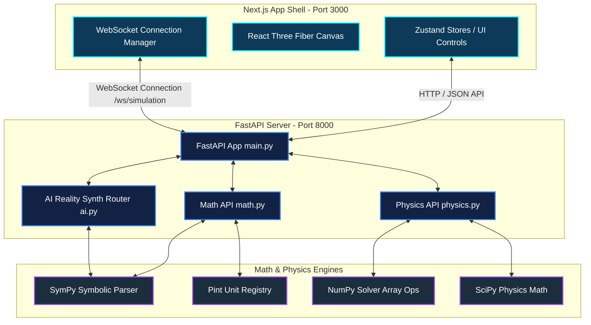
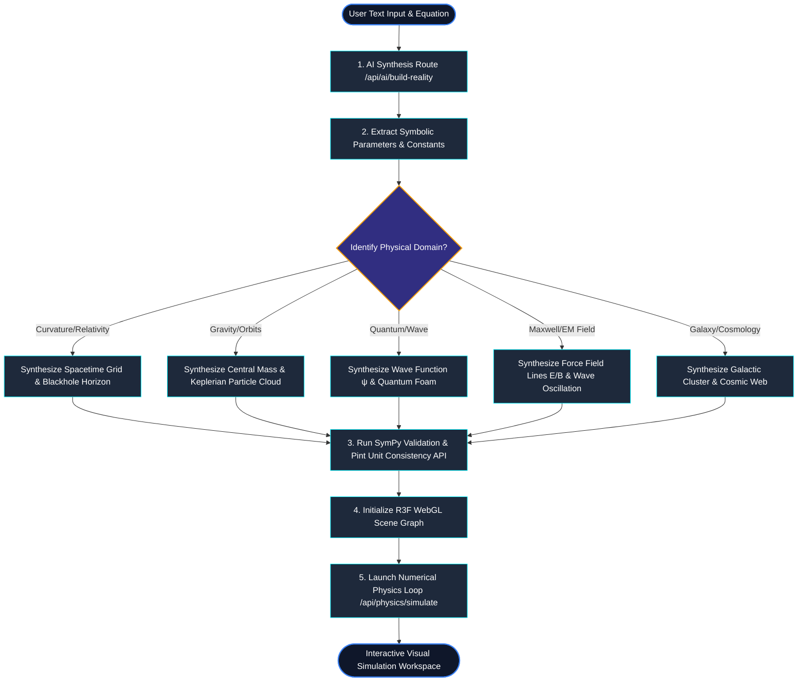

# 🪐 Genesis Reality Engine

Genesis is a premium, local-first mathematical and cosmological simulation workspace. It translates abstract physical theories and symbolic equations into interactive 3D realities using a combination of symbolic mathematics, numerical physical solvers, and high-performance WebGL rendering.

---

## 📌 Architecture & Design

Genesis is structured as a decoupled two-tier application containerized via Docker. It features a fast Python **FastAPI backend** running scientific simulation scripts and a modern **Next.js frontend** rendering real-time GPU-accelerated visualizations.

### 1. High-Level Component Architecture

The diagram below shows how the Next.js frontend communicates with the FastAPI service routers and scientific calculation libraries:



---

## 🔄 "Theory-To-Reality" Compilation Pipeline

When a user inputs a theory description (e.g., General Relativity or Quantum Mechanics) and a supporting physical equation, the application processes it through a multi-stage validation and synthesis pipeline:



---

## 📂 Project Structure

Below is an overview of the workspaces, components, and service routers powering the Genesis Reality Engine:

```text
.
├── backend/
│   ├── app/
│   │   ├── __init__.py
│   │   ├── main.py                     # FastAPI server, WebSocket endpoints, and CORS middleware
│   │   └── api/
│   │       ├── __init__.py
│   │       ├── ai.py                   # Synthesis endpoint mapping inputs to 3D scene schemas
│   │       ├── math.py                 # SymPy parsers, differentiation solvers, and unit check endpoints
│   │       └── physics.py              # Symplectic N-Body gravity solvers and orbit path calculators
│   ├── Dockerfile                      # Python slim image containerizer
│   └── requirements.txt                # Python backend dependencies
│
├── frontend/
│   ├── app/
│   │   ├── layout.tsx                  # Root Next.js layout configuration
│   │   ├── page.tsx                    # Main viewport containing panel components
│   │   └── globals.css                 # Custom HSL design variables and styling
│   ├── components/
│   │   ├── objects/                    # WebGL 3D meshes and shader components
│   │   │   ├── BlackHole.tsx           # Schwarzschild lensing simulator and horizon mesh
│   │   │   ├── Field.tsx               # Vector field line renderer
│   │   │   ├── Galaxy.tsx              # Spiral arms star generator
│   │   │   ├── ParticleSystem.tsx      # Multi-point coordinate array particle visualizer
│   │   │   ├── SpacetimeCurvature.tsx  # Dynamic grid deformation based on mass positioning
│   │   │   ├── Star.tsx                # Temperature-based color stars
│   │   │   └── Wave.tsx                # Mathematical wave function visualizer
│   │   ├── panel/                      # UI configuration panels
│   │   │   ├── AIPanel.tsx             # Collapsible prompt interaction drawer
│   │   │   ├── AIThinkingStages.tsx    # Multi-step progress tracker for reality creation
│   │   │   ├── HistoryPanel.tsx        # Version and snapshot rollback controller
│   │   │   ├── ObjectsPanel.tsx        # Interactive object adding menu
│   │   │   ├── TheoryInput.tsx         # Math/physics equation input panels
│   │   │   └── VariableEditor.tsx      # Real-time sliders adjusting physics variables
│   │   ├── shell/                      # Top bar navigation, toolbar, and bottom status bar
│   │   └── workspace/                  # RealityCanvas, grid helpers, and camera controls
│   ├── lib/
│   │   ├── api.ts                      # Client-side axios/fetch wrapper for backend REST API
│   │   └── utils.ts                    # Utility class names and helper logic
│   ├── stores/                         # Zustand global state structures
│   │   ├── useAIStore.ts               # Stages and text state management
│   │   ├── useSceneStore.ts            # Active 3D objects, variables, and equation definitions
│   │   ├── useSimulationStore.ts       # Time scaling, play/pause state, and simulation metrics
│   │   └── useToolStore.ts             # Workspace pointer tools state (move, select, duplicate)
│   ├── types/                          # TypeScript definitions (genesis.ts)
│   ├── Dockerfile                      # Multistage production-optimized node runner
│   ├── package.json                    # Frontend package versions and scripts
│   ├── tsconfig.json                   # TypeScript configuration
│   └── tailwind.config.ts              # Tailwind CSS properties
│
└── docker-compose.yml                  # Multi-container local orchestration script
```

---

## 💻 Technologies, Languages & Libraries

### Languages Used
* **Frontend**: TypeScript (TSX), JavaScript (ES6+)
* **Backend**: Python (3.11+)
* **Configuration**: Docker Compose YAML, JSON

### Libraries & Requirements

#### 🐍 Python Backend Requirements (from `backend/requirements.txt`)
* **FastAPI** (`>=0.100.0`): Asynchronous Python web API framework.
* **Uvicorn** (`>=0.22.0`): Asynchronous Server Gateway Interface (ASGI) runtime server.
* **Pydantic** (`>=2.0`): Schema definitions and validation.
* **SymPy** (`>=1.12`): Symbolic mathematics processor (differentiation, simplification, equation solving).
* **NumPy** (`>=1.24.0`): Matrix math and array solvers for N-body simulation metrics.
* **SciPy** (`>=1.10.0`): Scientific integration models.
* **Pint** (`>=0.22`): Advanced physical unit dimensional compatibility analysis.
* **Websockets** (`>=11.0.0`): Sub-communication routing.
* **Python-dotenv** (`>=1.0.0`): Environment configuration file loader.

#### 📦 Frontend Dependencies (from `frontend/package.json`)
* **Next.js** (`16.2.10`): Modern App Router react development framework.
* **React / React-DOM** (`19.2.4`): Core interface builder.
* **Three.js** (`^0.165.0`): The WebGL 3D rendering package.
* **@react-three/fiber** (`^9.6.1`): Declarative Three.js wrappers.
* **@react-three/drei** (`^10.7.7`): Helper utilities, camera setups, and controls for React Three Fiber.
* **@react-three/postprocessing** (`^3.0.4`): Post-processing shaders (bloom, curvature distortion).
* **Zustand** (`^4.5.7`): Lightweight state store client.
* **Framer Motion** (`^11.18.2`): Sleek transitions and dashboard animations.
* **KaTeX / React-KaTeX** (`^0.17.0`): Math typesetting rendering inside panels.
* **Leva** (`^0.9.36`): Floating GUI controller for testing numerical attributes.
* **Socket.io Client** (`^4.8.3`): Client-side Socket connections.
* **TailwindCSS** (`^4.0.0`): Dynamic styling framework.

---

## 🚀 Installation Process

### Option A: Unified Containerized Setup (Recommended)
If you have **Docker** and **Docker Compose** installed, you can skip individual package setup and boot the entire network with a single command:

```powershell
docker-compose up --build
```
This automatically boots:
* The **FastAPI backend** on `http://localhost:8000`
* The **Next.js frontend** on `http://localhost:3000`

---

### Option B: Local Manual Setup (Development)

#### Step 1: Set Up Backend
1. Navigate to the `backend` directory:
   ```powershell
   cd backend
   ```
2. Create and activate a Python virtual environment:
   ```powershell
   python -m venv .venv
   # Windows:
   .venv\Scripts\activate
   # macOS/Linux:
   source .venv/bin/activate
   ```
3. Install dependencies:
   ```powershell
   pip install -r requirements.txt
   ```

#### Step 2: Set Up Frontend
1. Open a new terminal in the `frontend` directory:
   ```powershell
   cd frontend
   ```
2. Install the required Node packages:
   ```powershell
   npm install --legacy-peer-deps
   ```

---

## 🏃 Running the Application

### Running with Docker Compose
```powershell
docker-compose up
```
To stop the containers:
```powershell
docker-compose down
```

### Running Manually (Hot-Reload Mode)

#### 1. Start the Backend API Server:
1. Activate your virtual environment inside `backend/` and run:
   ```powershell
   python -m app.main
   ```
   * Alternatively, run manually via Uvicorn:
     ```powershell
     uvicorn app.main:app --host 127.0.0.1 --port 8000 --reload
     ```
   * The API Swagger docs will be available at `http://localhost:8000/docs`

#### 2. Start the Frontend Server:
1. Navigate to the `frontend/` directory and run:
   ```powershell
   npm run dev
   ```
2. Open your web browser and navigate to: `http://localhost:3000`

---

## 🧪 Verifying the Installation

To verify the setup is operating correctly:
1. Open `http://localhost:3000`.
2. Open the **AI Panel** on the right side.
3. Input a theory like `Maxwell electrodynamics` or an equation like `F = G * M * m / r^2` and click **Build Reality**.
4. The panel will display the stage progress (Understanding → Building Spacetime → Rendering Reality), and custom physical entities (such as stellar bodies, force fields, or waves) will render in the 3D canvas viewport.
5. Hit the **Play** button in the bottom simulation timeline bar to test the N-body gravity physics calculations!
